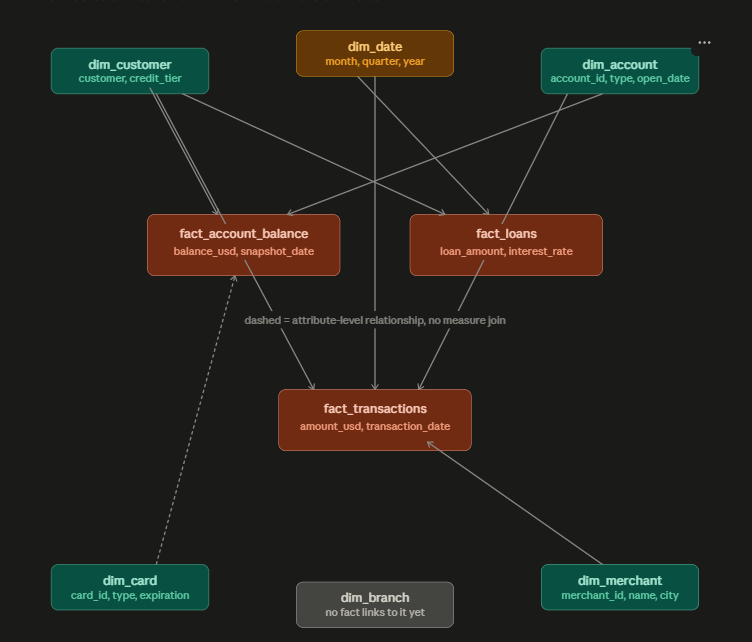

# Banking Data Pipeline (dbt + PostgreSQL)

Medallion architecture for a synthetic banking dataset:

**Bronze** (raw extract) → **Silver** (Data Vault) → **Gold** (Kimball star schema)

## Gold star schema



### Dimensions
| Model | Role |
|---|---|
| `dim_customer` | SCD2 customer attributes (`credit_tier`, `acquisition_month`, …) |
| `dim_account` | SCD2 account attributes + `customer_hub_key` |
| `dim_card` | SCD2 card attributes + `account_hub_key` (attribute-level via account) |
| `dim_merchant` | SCD2 merchant attributes |
| `dim_date` | Static calendar (`month`, `quarter`, `year`, …) |
| `dim_branch` | SCD2 branch attributes — orphan (no fact FK yet) |

### Facts
| Model | Grain | Key measures |
|---|---|---|
| `fact_transactions` | 1 transaction | `amount_usd`, `transaction_date` |
| `fact_loans` | 1 loan | `loan_amount`, `interest_rate` |
| `fact_account_balance` | 1 account (current snapshot) | `balance_usd`, `snapshot_date` |

**Join rules (SCD2 fan-out prevention):**
- Current-state: `join dim_x d on d.<entity>_hub_key = f.<entity>_hub_key and d.is_current`
- Point-in-time: `... and f.<event_date> >= d.effective_start_date and f.<event_date> < d.effective_end_date`
- Dashed links in the diagram (e.g. card → balance) are attribute-level relationships via account, not direct measure joins.

## Project layout

```
models/
├── bronze/          # raw extracts + record_source / _loaded_at
├── silver/
│   ├── hubs/
│   ├── links/
│   └── satellites/
└── gold/
    ├── dimensions/
    └── facts/
```

## Run

```bash
dbt build --select bronze
dbt build --select silver
dbt build --select gold
```

Or rebuild everything:

```bash
dbt build
```

## Stack
- dbt-postgres
- PostgreSQL
- `dbt_utils` (`generate_surrogate_key`, `date_spine`, `unique_combination_of_columns`)
